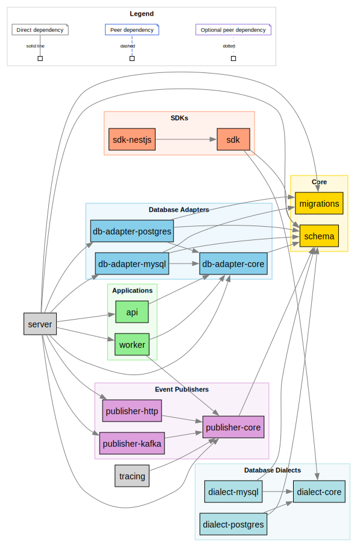

# Architecture

Outboxy is a transactional outbox and inbox service built as a pnpm monorepo with 19 packages organized in layers, supporting PostgreSQL and MySQL.

## Package Dependency Graph



## Layered Architecture

The diagram below shows how packages are grouped and how control flows between the user's application and the Outboxy services.

```
                       +------------------+
  User's Application   |  sdk  sdk-nestjs |   (runs in user's process)
                       +--------+---------+
                                |
                     dialect-core, schema
                                |
         +----------------------+----------------------+
         |                                             |
  dialect-postgres                              dialect-mysql
         |                                             |
         +----------------------+----------------------+
                                |
  - - - - - - - - - - - - - - - - - - - - - - - - - - -
                                |
  Outboxy Services       +------+------+
  (run as containers)    | api  worker |
                         +------+------+
                                |
                         db-adapter-core
                         |             |
                  db-adapter-     db-adapter-
                  postgres         mysql
                         |             |
                         +------+------+
                                |
                         publisher-core
                         |             |
                  publisher-      publisher-
                  http              kafka
                         |             |
                    HTTP endpoints  Kafka brokers
```

### Foundation Layer

- **schema** -- Shared constants for table names, column names, event statuses, destination types, Zod validation schemas, and TypeScript interfaces. Every other package depends on this package.
- **dialect-core** -- Interfaces (`SqlDialect`, `InboxSqlDialect`) that define the contract for database-specific SQL generation (INSERT, ON CONFLICT, RETURNING).

### Dialect Layer

- **dialect-postgres** -- PostgreSQL SQL generation: `$N` placeholders, `ON CONFLICT` with partial unique index for outbox events, `ON CONFLICT DO NOTHING` for inbox events, and `RETURNING`.
- **dialect-mysql** -- MySQL SQL generation: `?` placeholders, `INSERT IGNORE` for inbox events, `ON DUPLICATE KEY UPDATE` for outbox events. MySQL has no `RETURNING` support; the dialect uses pre-generated UUIDs instead.

### SDK Layer (runs in the user's application)

- **sdk** -- `OutboxyClient<T>` for publishing outbox events and `InboxyClient<T>` for idempotent inbox consumption. Also exports `createOutboxy()`, a factory that creates both clients with shared configuration. The SDK executes raw INSERT statements within the user's database transaction and does not make HTTP calls.
- **sdk-nestjs** -- NestJS module wrapper around `@outboxy/sdk`.

### Database Adapter Layer (runs in Outboxy services)

- **db-adapter-core** -- Interfaces: `EventRepository` (worker operations: claim, retry, DLQ), `EventService` (API operations: query, status), `MaintenanceOperations` (stale recovery, cleanup), `InboxRepository`, and `DatabaseAdapter`.
- **db-adapter-postgres** -- PostgreSQL implementations using `pg`. The claim query uses `FOR UPDATE SKIP LOCKED`.
- **db-adapter-mysql** -- MySQL implementations using `mysql2/promise`.

### Publisher Layer

- **publisher-core** -- `Publisher` interface with a single `publish(events)` method returning a `Map<eventId, PublishResult>`.
- **publisher-http** -- HTTP webhook publisher using `undici`.
- **publisher-kafka** -- Apache Kafka publisher using `kafkajs`.

### Application Layer

- **api** -- Fastify REST API for admin and observability: event status lookup, admin operations (replay, cancel, purge), and health checks. Event creation is intentionally not in the API; it happens via the SDK inside the user's transaction.
- **worker** -- Polls `outbox_events` for pending outbox events, publishes them via the configured publisher, and manages retry and DLQ. Supports adaptive polling, worker clusters, and Prometheus metrics.
- **server** -- Deployment package that bundles the API and worker with CLI entry points, adapter and publisher factories, and a Docker build context.

### Supporting Packages

- **migrations** -- Database migration runner for outbox and inbox tables.
- **logging** -- Shared pino-based structured logging with config validation.
- **testing-utils** -- Test helpers and isolated pool management for integration tests.
- **e2e** -- End-to-end integration test suite.

## What Runs Where

| Component                             | Where it runs               | What it does                                                       |
| ------------------------------------- | --------------------------- | ------------------------------------------------------------------ |
| SDK (`OutboxyClient`, `InboxyClient`) | User's application process  | Executes INSERT SQL within the user's database transaction         |
| API                                   | Outboxy container / service | Admin REST API for observability (event status, replay, health)    |
| Worker                                | Outboxy container / service | Polls `outbox_events`, publishes to destinations, manages retries  |
| Database                              | PostgreSQL or MySQL         | Stores `outbox_events`, `inbox_events`, and `outbox_config` tables |

## Dual-Pattern Architecture

Outboxy implements two complementary patterns.

**Outbox** (producer-side): Guarantees outbox event publishing with at-least-once delivery. The SDK inserts outbox events into `outbox_events` within the user's transaction. The worker polls and delivers outbox events to HTTP endpoints or Kafka topics.

**Inbox** (consumer-side): Guarantees idempotent inbox event consumption. The SDK inserts into `inbox_events` with `ON CONFLICT DO NOTHING`, deduplicating by `idempotency_key`. No background worker is needed; deduplication is a library-only operation.

When both patterns are used in a single transaction (inbox receive + business logic + outbox publish), the system achieves exactly-once processing semantics.
